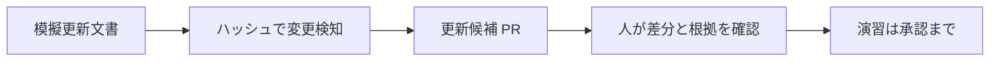

# GitHub Actions を動かして学ぶワークショップ

AWS セキュリティガイドラインの更新を題材に、**変更に気づく → 更新候補を作る → 人がレビューする** 流れを体験します。対象は GitHub Actions 未経験の情報システム・クラウド基盤担当者です。プログラミング経験は不要です。

**まずは完成済みの仕組みを動かします。基礎編ではインストールもコマンド入力も不要です。** ソースを理解したいときだけ、各 Step 末尾のリンクを開いてください。

入力もガイドラインも架空の演習データです。実 AWS、SharePoint、Microsoft Graph、社内ネットワークには接続しません。ただし、Actions 自体は GitHub のサービスや Action を取得するためネットワークを使います。Advanced は AI サービスへ模擬文書を送ります。業務文書や秘密情報に置き換えないでください。

## 始める前に（参加者）

- [ ] 講師から渡された**自分用の組織所有リポジトリ**を開いた。
- [ ] 上部に `Code`、`Pull requests`、`Actions` が見える。
- [ ] 講師が自分に write 権限を付与したことを確認した。
- [ ] 自分以外のレビュー担当者が誰か分かる。
- [ ] ブランチ名が `main` になっている。

この文書が資料集のサブフォルダー内に見えている場合は、まだ演習環境ではありません。フォルダー内の `.github/workflows/` を親リポジトリの Actions が見つけることはできません。講師は先に [docs/instructor.md](docs/instructor.md) の手順で**このフォルダーの中身だけ**を独立リポジトリのルートへ配置してください。

`Settings` が見えないことは write 権限がないことを意味しません。設定の変更は講師が担当します。権限エラーは、そのまま講師へ伝えてください。

## 今日の現在地

基礎60分は導入・概念15分、以下の操作40分、セキュリティと振り返り5分です。Advanced 30分は最後に分けて行います。

| 順番 | 目安 | やること | 終了の目印 |
| --- | --- | --- | --- |
| Step 1 | 10分 | 手動で Hello を動かす | ログにあいさつが出る |
| Step 2 | 8分 | 文書を少し編集する | 見出し検査が成功する |
| Step 3 | 10分 | 更新文書の変更を検知する | 「変更なし」から「変更あり」になる |
| Step 4 | 7分 | 更新候補 PR を作る | bot の PR が1件できる |
| Step 5 | 5分 | 人がレビューする | 根拠と差分を確認して承認する |

## 最初に覚える4語

| 言葉 | この演習での意味 |
| --- | --- |
| workflow | 自動処理の手順書。Actions 左メニューから選ぶもの |
| job / step | 処理のまとまり / その中の一つひとつの手順 |
| commit | ファイル変更を履歴に記録する操作 |
| Pull Request（PR） | 変更を取り込んでよいか、他の人に見てもらう依頼 |

`main` は全員が参照する確定版です。ブランチは変更作業用のコピーです。**main には直接書き込まず、変更用ブランチから PR を出します。** 前半の練習用 PR は人がマージしますが、最後の自動生成 PR は当日はマージしません。

## Step 1: 手動で実行してログを見る

**目的**: 「いつ動くか」と「どこで結果を見るか」を体験します。

1. 上部の `Actions` を開きます。
2. 左側の `01 Hello Actions` を選びます。
3. 右側の `Run workflow` を開き、`Branch: main` を確認します。
4. メニュー内の `Run workflow` を押します。二度押しは不要です。
5. 実行一覧に新しい行が出たら開きます。表示されない場合はページを再読み込みします。
6. 左側の `say-hello` を選び、「あいさつをログに表示する」を開きます。

**期待結果**: 緑のチェックが付き、`Hello, GitHub Actions!` と表示されます。「実行場所ときっかけを確認する」には `triggered by = workflow_dispatch` が出ます。

**確認ポイント**: 一覧の1行が run（1回の実行）、`say-hello` が job、その中の折りたたまれた行が step です。

**困ったら**: `Run workflow` がなければ講師に既定ブランチへの配置を確認してもらいます。赤い場合は最初に失敗した step を開きます。[docs/troubleshooting.md](docs/troubleshooting.md) も参照できます。

読むコード: [.github/workflows/hello-actions.yml](.github/workflows/hello-actions.yml)。`on` がきっかけ、`run` が実行するコマンドです。

## Step 2: 文書を小さく編集して検査する

**目的**: ファイルの変更をきっかけに、自動で検査されることを確認します。

1. `Code` に戻り、[guidelines/aws-security-guideline.md](guidelines/aws-security-guideline.md) を開きます。
2. 鉛筆アイコン `Edit this file` を押します。
3. 「確認日を記録します。」だけを「確認日と担当者を記録します。」に変えます。先頭の `#` は消しません。
4. `Commit changes...` を押します。
5. コミットメッセージを「演習: 担当者の記録を追加」にします。
6. `Create a new branch for this commit and start a pull request` を選び、ブランチ名を `practice/guideline-note` にします。
7. 確定後の画面で `base: main` を確認し、`Create pull request` を押します。
8. PR の `Checks` で `02 Check Guidelines` の `lint-markdown` が成功したことを確認します。`Actions` から同じ実行を開くと Summary に対象数が出ます。
9. レビュー担当者に依頼します。承認後、講師または担当者が `Merge pull request` → `Confirm merge` で取り込みます。

**期待結果**: ガイドラインの変更時に検査が動き、Summary に「検査成功: 1 ファイル」と表示されます。push と PR の両イベントを定義しているので、複数の run が見えることがあります。

**確認ポイント**: `paths` は「起動するか」の条件です。起動した後はガイドライン配下の Markdown をすべて検査します。変更ファイルだけを検査する仕組みではありません。

**困ったら**: 「H1 見出しがありません」は先頭の `#` と半角スペースを戻します。PR の `Files changed` から対象ファイルを編集し、**同じ変更用ブランチ**へ追加コミットすると再検査されます。自分が作った PR を自分で承認することはできません。

読むコード: [.github/workflows/check-guidelines.yml](.github/workflows/check-guidelines.yml)、[scripts/check-guidelines.sh](scripts/check-guidelines.sh)。対象外のファイルだけを変えたときは起動せず、手動実行では `paths` に関係なく動きます。

## Step 3: 「変更なし」から「変更あり」へ

**目的**: 内容の意味を AI に聞かず、ハッシュ（内容から計算した指紋）で違いを見つけます。

1. `Actions` → `03 Detect Source Change` → `Run workflow` を選びます。
2. `Branch: main` のまま実行します。run を開き、Summary の「変更なし」を確認します。
3. `Code` に戻って `main` を選び、[fixtures/aws-update-addition.md](fixtures/aws-update-addition.md) の見出しから最後までをコピーします。これは**追記用の見本**です。このファイル自体は編集しません。
4. [sources/aws-updates.md](sources/aws-updates.md) を編集し、末尾に空行を1つ入れてコピーした文章を追記します。もとの文章は残します。
5. Step 2 と同じ操作で、新しいブランチ `practice/source-update` と PR を作ります。
6. レビュー担当者が承認し、人がこの**入力用 PR** を `main` にマージします。今回はガイドラインを変えていないので見出し検査が動かなくても正常です。
7. `03 Detect Source Change` を `main` で新しく実行します。古い run の `Re-run jobs` ではなく `Run workflow` を使います。

**期待結果**: Summary が「変更あり」になり、取込済みと現在の2つのハッシュが異なります。**PR はまだ作られません。**

**確認ポイント**: [sources/.ingested-hash](sources/.ingested-hash) は前回取り込んだ文書の指紋です。自分では編集しません。ガイドラインだけを編集した Step 2 では、監視対象の更新文書は変わらないため「変更なし」です。

**困ったら**: 「変更なし」のままなら、追記を `main` にマージしたか確認します。job が skip なら `main` を選んでください。初回から変更ありなら講師に初期データの復元を依頼します。

読むコード: [.github/workflows/detect-source-change.yml](.github/workflows/detect-source-change.yml)、[scripts/compare-source.sh](scripts/compare-source.sh)。`changed` と `new_hash` が job の `outputs` です。定期実行は [examples/README.md](examples/README.md) で構文を確認し、当日は待ちません。

## Step 4: 更新候補 PR を作る

**目的**: 検知したときだけ、必要な権限を使ってレビュー依頼を作ります。

1. `Actions` → `04 Propose Guideline Update` を選びます。
2. `Run workflow` で `Branch: main` を確認して実行します。
3. run の図で `detect` → `propose` の順に動くことを確認します。
4. Summary に表示された「更新候補 PR」のリンクを開きます。

**期待結果**: bot が「AWS更新に伴うガイドライン更新候補（演習）」を1件作成します。変更がなければ `propose` は skip されます。

**確認ポイント**: PR の変更は、ガイドラインへの確認待ち文と取込済みハッシュの2ファイルです。本文を適切に改定したわけではありません。**機械は違いを検知しただけで、反映すべきかは判断していません。**

**再実行しても大丈夫?** 同じ入力なら既存 PR のリンクを返します。閉じた PR を勝手に作り直したり、レビュー中の本文を上書きしたりしません。途中で PR 作成だけ失敗しても、push 済みブランチを使って復旧します。

**困ったら**: 権限エラーは講師へ連絡します。「既定ブランチが更新されています」なら `Run workflow` から新しく実行してください。

読むコード: [.github/workflows/propose-guideline-update.yml](.github/workflows/propose-guideline-update.yml)。まず `needs`、`if`、`permissions` の3か所だけ読みます。[scripts/propose-update.sh](scripts/propose-update.sh) の再実行処理は持ち帰り用です。

## Step 5: 根拠を確認してレビューする

**目的**: 自動生成でも、最終判断を人が行うことを確認します。

1. PR の `Reviewers` に講師が用意したチームが要求されていることを確認します。
2. `Files changed` を開き、確認待ち文とハッシュの変更を見ます。
3. PR 本文の「検知した更新文書」を開き、判断の入力を確認します。このリンクは検知時点のコミットを指します。
4. PR 本文の「生成元の実行ログ」を開き、成功した run へ戻れることを確認します。
5. `Approve workflows to run` が表示された場合は、差分を確認してから write 権限のある担当者が実行を承認し、検査を確認します。**検査実行の承認と、PR レビューの承認は別です。**
6. CODEOWNERS の担当者が `Files changed` → `Review changes` → `Approve` → `Submit review` で承認します。参加者は確認した根拠をコメントしても構いません。

**期待結果**: レビュー記録付きの候補 PR が残ります。**当日はこの PR をマージしません。** `main` の取込済みハッシュは古いままなので、検知をやり直すと「変更あり」のままです。これは正常です。

**困ったら**: Reviewers が空なら、講師に CODEOWNERS のチーム名と権限を確認してもらいます。`Checks` は候補 PR の検査であり、その PR を作った run そのものではありません。生成元は必ず本文のリンクから辿ります。

読む設定: [.github/CODEOWNERS](.github/CODEOWNERS)。レビュー要求の自動化には実在するチームの設定が必要です。レビューを必須にする ruleset は講師が設定しています。

## 振り返り（5分）

- [ ] 手動実行した workflow のログを開ける。
- [ ] push / PR / 手動 / 定期という起動方法を区別できる。
- [ ] 「内容が違う」と「改定すべき」は違う判断だと説明できる。
- [ ] read は検知、write は候補 PR を作る job だけに必要だと説明できる。
- [ ] PR から入力文書・実行ログ・レビュー記録を辿れる。

次は [docs/advanced.md](docs/advanced.md) の Advanced です。基礎だけ参加する方はここで完了です。

## 持ち帰り用の案内

| やりたいこと | 読むもの |
| --- | --- |
| AI で影響候補を Issue にまとめる | [docs/advanced.md](docs/advanced.md) |
| 定期実行・入力欄・artifact・Issue 通知を試す | [examples/README.md](examples/README.md) |
| 環境を準備する、初期状態に戻す | [docs/instructor.md](docs/instructor.md) |
| エラーを切り分ける | [docs/troubleshooting.md](docs/troubleshooting.md) |
| 公式仕様と検証範囲を確認する | [docs/references.md](docs/references.md) |

このフォルダーは配布用のサンプルです。GitHub 上での組織設定・PR 作成・AI 実行の確認は、講師の演習環境で行ってください。
