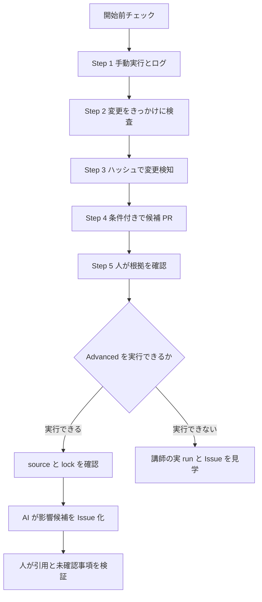
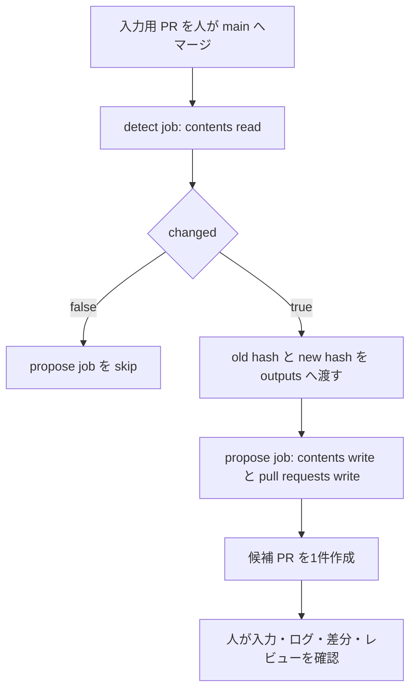

# GitHub Actions を動かして学ぶワークショップ

AWS セキュリティガイドラインの更新を題材に、**変更を検知し、更新候補を作り、人が判断する**流れを学びます。対象は GitHub Actions 未経験の情報システム・クラウド基盤担当者です。プログラミング経験は必要ありません。

完成済みの仕組みを GitHub の Web UI から動かします。基礎編60分とAdvanced 30分の構成です。Advancedを実行できない場合は見学ルートで同じ確認を行います。受講者はインストールもコマンド入力も行いません。

## 90分後の到達点

- workflow を手動実行し、run、job、step の順にログを開ける。
- ファイル変更をきっかけに検査を動かし、ハッシュで変更を検知できる。
- `outputs`、`needs`、`if` とjobごとの権限を使った処理の流れを説明できる。
- 自動生成されたPRから、入力文書、実行ログ、差分、レビュー記録を辿れる。
- Advancedでは、Agentic Workflowのsource、生成lock、safe output、人の判断の境界を説明できる。

## 演習データと外部接続

入力文書とガイドラインは架空です。実際のAWS、SharePoint、Microsoft Graph、社内ネットワークには接続しません。GitHub ActionsはGitHubのサービスとActionを取得するためにネットワークを使います。Advancedでは模擬文書をAIサービスへ送ります。

> [!IMPORTANT]
> 業務文書、個人情報、秘密情報を演習データへ貼り付けないでください。

## 参加者と講師の役割

| 担当 | この演習で行うこと |
| --- | --- |
| 参加者 | Web UIでworkflowを実行し、変更用ブランチ、PR、ログ、Issueを確認する |
| レビュー担当者 | 参加者が作成したPRを確認し、入力用PRをマージする |
| 講師 | リポジトリ、権限、CODEOWNERS、ruleset、Advancedの認証と予算を準備する |

## 始める前に（参加者）

- [ ] 講師から渡された**自分用の組織所有リポジトリ**を開いた。
- [ ] 上部に `Code`、`Pull requests`、`Actions` が見える。
- [ ] 講師が自分に write 権限を付与したことを確認した。
- [ ] 自分以外のレビュー担当者が誰か分かる。
- [ ] ブランチ名が `main` になっている。

> [!WARNING]
> この文書が資料集のサブフォルダー内にある場合は開始しないでください。`.github/workflows/` がリポジトリ直下にある演習用リポジトリを講師から受け取ります。講師は[配布手順](docs/instructor.md#2-配布用リポジトリを準備する)を確認してください。

`Settings` が見えないことは write 権限がないことを意味しません。設定の変更は講師が担当します。権限エラーは、そのまま講師へ伝えてください。

## 90分の学習経路

| 区分 | 目安 | 終了の目印 |
| --- | --- | --- |
| 基礎の導入 | 15分 | 用語と全体の流れを説明できる |
| Step 1-5 | 40分 | 候補PRの根拠と差分を確認できる |
| 基礎の振り返り | 5分 | 自動化と人の判断の境界を説明できる |
| Advancedの実行または見学 | 30分 | source、lock、safe outputの役割を説明できる |

Step 1〜5の40分は、レビュー担当者が入力用PRへすぐ対応できる前提です。講師はレビュー待ちで進行が止まらない体制を用意します。

## 目次

- [Step 1: 手動で実行してログを見る](#step-1-手動で実行してログを見る)
- [Step 2: 文書を小さく編集して検査する](#step-2-文書を小さく編集して検査する)
- [Step 3: 変更なしから変更ありへ](#step-3-変更なしから変更ありへ)
- [Step 4: 更新候補 PR を作る](#step-4-更新候補-pr-を作る)
- [Step 5: 根拠を確認してレビューする](#step-5-根拠を確認してレビューする)
- [振り返り](#振り返り5分)
- [Advanced: AI に影響候補をまとめてもらう](docs/advanced.md)

## 最初に覚える4語

| 言葉 | この演習での意味 |
| --- | --- |
| workflow | 自動処理の手順書。Actions 左メニューから選ぶもの |
| job / step | 処理のまとまり / その中の一つひとつの手順 |
| commit | ファイル変更を履歴に記録する操作 |
| Pull Request（PR） | 変更を取り込んでよいか、他の人に見てもらう依頼 |

`main` は全員が参照する確定版です。ブランチは変更作業用のコピーです。`main` へ直接書き込まず、変更用ブランチからPRを作ります。Step 2と3の入力用PRは人がマージします。Step 4の自動生成PRは当日マージしません。

## Step 1: 手動で実行してログを見る

**ゴール**: workflowを手動実行し、run、job、stepのログを開きます。

1. 上部の `Actions` を開きます。
2. 左側の `01 Hello Actions` を選びます。
3. 右側の `Run workflow` を開き、`Branch: main` を確認します。
4. メニュー内の `Run workflow` を押します。二度押しは不要です。
5. 実行一覧に新しい行が出たら開きます。表示されない場合はページを再読み込みします。
6. 左側の `say-hello` を選び、「あいさつをログに表示する」を開きます。

### Step 1の成功の目印

- 緑のチェックが付く。
- ログに `Hello, GitHub Actions!` と表示される。
- 「実行場所ときっかけを確認する」に `triggered by = workflow_dispatch` と表示される。

**ここで学ぶこと**: Actions一覧の1行がrun、`say-hello` がjob、その中の折りたたまれた行がstepです。`workflow_dispatch` はWeb UIから手動実行するきっかけです。

**詰まったとき**: [Step 1-2の確認表](docs/troubleshooting.md#step-1-2)を開きます。

**コードを見る（任意）**: [.github/workflows/hello-actions.yml](.github/workflows/hello-actions.yml) の `on` がきっかけ、`run` が実行するコマンドです。

## Step 2: 文書を小さく編集して検査する

**ゴール**: ガイドラインの変更をきっかけに検査を動かし、PRから結果を確認します。

1. `Code` に戻り、[guidelines/aws-security-guideline.md](guidelines/aws-security-guideline.md) を開きます。
2. 鉛筆アイコン `Edit this file` を押します。
3. 「確認日を記録します。」だけを「確認日と担当者を記録します。」に変えます。先頭の `#` は消しません。
4. `Commit changes...` を押します。
5. コミットメッセージを「演習: 担当者の記録を追加」にします。
6. `Create a new branch for this commit and start a pull request` を選び、ブランチ名を `practice/guideline-note` にします。
7. 確定後の画面で `base: main` を確認し、`Create pull request` を押します。
8. PR の `Checks` で `02 Check Guidelines` の `lint-markdown` が成功したことを確認します。`Actions` から同じ実行を開くと Summary に対象数が出ます。
9. レビュー担当者に依頼します。承認後、講師または担当者が `Merge pull request` → `Confirm merge` で取り込みます。

### Step 2の成功の目印

- `lint-markdown` が成功する。
- Summaryに「検査成功: 1 ファイル」と表示される。
- 他者の承認後に入力用PRが `main` へマージされる。

**ここで学ぶこと**: `push` と `pull_request` はファイル変更を受け取るきっかけです。両方を定義しているため、同じ変更に関係するrunが複数見えることがあります。`paths` は起動条件です。起動後は `guidelines/` 配下のMarkdownをすべて検査します。

**詰まったとき**: [Step 1-2の確認表](docs/troubleshooting.md#step-1-2)を開きます。同じ変更用ブランチへ追加コミットすると再検査できます。自分が作ったPRは自分で承認できません。

**コードを見る（任意）**: [.github/workflows/check-guidelines.yml](.github/workflows/check-guidelines.yml) と [scripts/check-guidelines.sh](scripts/check-guidelines.sh)。対象外のファイルだけを変えたときは起動せず、手動実行では `paths` に関係なく動きます。

## Step 3: 変更なしから変更ありへ

**ゴール**: 内容の意味をAIに聞かず、ハッシュで更新文書の違いを見つけます。

1. `Actions` → `03 Detect Source Change` → `Run workflow` を選びます。
2. `Branch: main` のまま実行します。run を開き、Summary の「変更なし」を確認します。
3. `Code` に戻って `main` を選び、[fixtures/aws-update-addition.md](fixtures/aws-update-addition.md) の見出しから最後までをコピーします。これは**追記用の見本**です。このファイル自体は編集しません。
4. [sources/aws-updates.md](sources/aws-updates.md) を編集し、末尾に空行を1つ入れてコピーした文章を追記します。もとの文章は残します。
5. Step 2 と同じ操作で、新しいブランチ `practice/source-update` と PR を作ります。
6. レビュー担当者が承認し、人がこの**入力用 PR** を `main` にマージします。今回はガイドラインを変えていないので見出し検査が動かなくても正常です。
7. `03 Detect Source Change` を `main` で新しく実行します。現在の `main` を取得するため、古いrunの `Re-run jobs` ではなく `Run workflow` を使います。

### Step 3の成功の目印

- 最初のrunは「変更なし」と表示される。
- 追記をマージした後の新しいrunは「変更あり」と表示される。
- 取込済みと現在の2つのハッシュが異なる。
- このStepではPRが作られない。

**ここで学ぶこと**: [sources/.ingested-hash](sources/.ingested-hash) は前回取り込んだ文書の指紋です。参加者は編集しません。Step 2では更新文書を変えていないため、最初の実行は「変更なし」です。

**詰まったとき**: [Step 3-5の確認表](docs/troubleshooting.md#step-3-5)を開きます。

**コードを見る（任意）**: [.github/workflows/detect-source-change.yml](.github/workflows/detect-source-change.yml) と [scripts/compare-source.sh](scripts/compare-source.sh)。`changed` と `new_hash` がjobの `outputs` です。

## Step 4: 更新候補 PR を作る

**ゴール**: 変更を検知したときだけ、書き込み権限を持つjobを動かして候補PRを作ります。

| コード | このworkflowでの役割 |
| --- | --- |
| `outputs` | `detect` の変更有無と2つのハッシュを後続へ渡す |
| `needs: detect` | `propose` を `detect` の完了後に動かす |
| `if` | `changed` が `true` の場合だけ `propose` を動かす |
| `permissions` | `detect` は読み取りだけ、`propose` だけに書き込みを許可する |

1. `Actions` → `04 Propose Guideline Update` を選びます。
2. `Run workflow` で `Branch: main` を確認して実行します。
3. run の図で `detect` → `propose` の順に動くことを確認します。
4. Summary に表示された「更新候補 PR」のリンクを開きます。

### Step 4の成功の目印

- `detect` の後に `propose` が動く。
- 「AWS更新に伴うガイドライン更新候補（演習）」というPRが1件できる。
- PRの変更対象がガイドラインの確認待ち文と取込済みハッシュの2ファイルになる。

**ここで学ぶこと**: 機械は内容の違いを検知しただけです。反映すべきか、どの文章へ改定すべきかは判断していません。同じ入力で再実行すると既存PRのリンクを返します。閉じたPRを自動再作成せず、レビュー中の本文も上書きしません。

**詰まったとき**: [Step 3-5の確認表](docs/troubleshooting.md#step-3-5)を開きます。「既定ブランチが更新されています」と表示された場合は、`Run workflow` から新しく実行します。

**コードを見る（任意）**: [.github/workflows/propose-guideline-update.yml](.github/workflows/propose-guideline-update.yml) の `outputs`、`needs`、`if`、`permissions` を読みます。[scripts/propose-update.sh](scripts/propose-update.sh) の再実行処理は持ち帰り用です。

## Step 5: 根拠を確認してレビューする

**ゴール**: 候補PRから入力、実行ログ、差分、レビュー記録を辿り、最終判断を人が行います。

1. PR の `Reviewers` に講師が用意したチームが要求されていることを確認します。
2. `Files changed` を開き、確認待ち文とハッシュの変更を見ます。
3. PR 本文の「検知した更新文書」を開き、判断の入力を確認します。このリンクは検知時点のコミットを指します。
4. PR 本文の「生成元の実行ログ」を開き、成功した run へ戻れることを確認します。
5. `Approve workflows to run` が表示された場合は、差分を確認してから write 権限のある担当者が実行を承認し、検査を確認します。**検査実行の承認と、PR レビューの承認は別です。**
6. CODEOWNERS の担当者が `Files changed` → `Review changes` → `Approve` → `Submit review` で承認します。参加者は確認した根拠をコメントしても構いません。

### Step 5の成功の目印

- PR本文から検知時点の入力文書と生成元runを開ける。
- `Files changed` で2ファイルの差分を確認できる。
- CODEOWNERSによるレビュー記録が残る。
- 候補PRはマージせず、openのまま残る。

**ここで学ぶこと**: 自動生成された候補にも入力、実行、差分、承認の証跡が必要です。候補PRをマージしないため、`main` の取込済みハッシュは古いままです。もう一度検知すると「変更あり」と表示されます。

**詰まったとき**: [Step 3-5の確認表](docs/troubleshooting.md#step-3-5)を開きます。`Checks` は候補PRの検査です。生成元はPR本文のリンクから開きます。

**設定を見る（任意）**: [.github/CODEOWNERS](.github/CODEOWNERS)。レビュー要求には、実在して対象リポジトリへのwrite権限を持つチームが必要です。

## 振り返り（5分）

- [ ] `Actions` からrun、job、stepの順にログを開ける。
- [ ] 手動、push、pull requestの3つの起動方法を、この演習のrunで示せる。
- [ ] 「内容が違う」と「改定すべき」が別の判断であると説明できる。
- [ ] `detect` は読み取りだけ、`propose` だけに書き込み権限が必要な理由を説明できる。
- [ ] 候補PRから入力文書、生成元run、差分、レビュー記録を辿れる。

基礎編はここで完了です。講師が実行可否を確認済みなら、[Advanced](docs/advanced.md)へ進みます。利用できない場合も、講師の実runを使う見学ルートがあります。

## 持ち帰り用の案内

| やりたいこと | 読むもの |
| --- | --- |
| AI で影響候補を Issue にまとめる | [docs/advanced.md](docs/advanced.md) |
| 定期実行・入力欄・artifact・Issue 通知を試す | [examples/README.md](examples/README.md) |
| 環境を準備する、初期状態に戻す | [docs/instructor.md](docs/instructor.md) |
| エラーを切り分ける | [docs/troubleshooting.md](docs/troubleshooting.md) |
| 公式仕様と検証範囲を確認する | [docs/references.md](docs/references.md) |

定期実行は基礎編で実行していません。任意学習で構文と停止方法を確認します。このフォルダーは配布用サンプルのため、組織設定、PR作成、AI実行は講師が準備した演習環境で行ってください。
