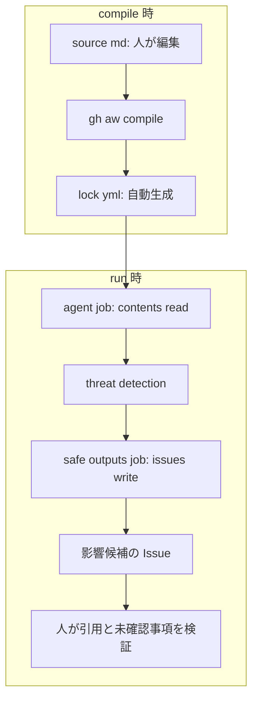

# Advanced: AI に影響候補をまとめてもらう

[基礎編に戻る](../README.md) | [困ったとき](troubleshooting.md#advanced)

GitHub Agentic WorkflowsはPublic Previewです。この教材は `gh-aw v0.88.7` で生成・検証しています。講師は開催前に[公式チュートリアル](https://docs.github.com/en/actions/tutorials/develop-agentic-workflows-in-github-actions)と組織ポリシーを再確認します。

## この30分でできるようになること

- 通常ActionsとAgentic Workflowを使い分ける基準を説明する。
- 人が編集するsourceと、自動生成されるlockを区別する。
- 読み取り中心のagentと、書き込みを行うsafe outputの境界を確認する。
- AIが作ったIssueを元文書と照合し、人が判断すべき事項を残す。

## 開始前の分岐（2分）

- [ ] 基礎Step 3の入力用PRが `main` へマージされている。
- [ ] 講師からAdvancedを実行してよいと案内された。
- [ ] `Actions` に `Advanced Guideline Impact Report` が表示される。

3項目すべてを確認できた場合は[構造を読む](#sourceからissueまでの構造8分)へ進みます。1項目でも確認できない場合は[見学ルート](#見学ルート10分)へ進みます。

このリポジトリでは組織課金を利用できないため、すべてのAgentic Workflowを個人PATで実行します。講師がfine-grained PATをrepository secret `COPILOT_GITHUB_TOKEN` に登録し、参加者はtokenやsecretを操作しません。

組織所有リポジトリでは、本来は個人資格情報を持ち込まない組織課金が望ましい構成です。ただし、利用可能になるまではPAT構成を維持し、sourceを組織課金へ戻しません。認証の理由と管理方法は[編集とcompile](agentic-authoring.md#このリポジトリの認証方針)で確認できます。

## 通常Actionsとの違い（5分）

| 観点 | 通常Actions | Agentic Workflow |
| --- | --- | --- |
| 処理 | YAMLとスクリプトで決めた手順 | Markdownの指示をAI agentが解釈 |
| この演習の例 | ハッシュが同じか比較 | どの節へ影響しそうか整理 |
| 出力 | 同じ入力なら同じ判定 | 表現や候補がrunごとに変わり得る |
| 書き込み | 権限を持つjobが候補PRを作る | safe output jobがIssueを作る |
| 費用 | Actions実行時間 | Actions実行時間とAI利用量 |
| 最終判断 | 人がPRをレビュー | 人がIssueの引用と推論を検証 |

ハッシュ比較のように決まった手順で解ける処理は通常Actionsを使います。文脈の解釈が必要な場合だけAgentic Workflowを検討します。

## sourceからIssueまでの構造（8分）

図を文章にすると、次の順序です。

1. 人がMarkdownのsourceを編集する。
2. `gh aw compile` がGitHub Actions用のlockを生成する。
3. agent jobが模擬文書を読み、影響候補を整理する。
4. threat detectionが出力を検査する。
5. 書き込み権限を持つsafe outputs jobがIssueを作る。
6. 人が元文書とIssueを照合する。

[source](../.github/workflows/guideline-impact-report.md)を開き、先頭の `---` で囲まれたfrontmatterと、その後のAIへの指示を確認します。

| 設定 | この例での意味 |
| --- | --- |
| `on.workflow_dispatch` | 人が開始した場合だけ実行する |
| `contents: read` | agentがリポジトリの内容を読む |
| `copilot-requests: none` | 組織課金を無効にし、repository secretのPATを使う |
| `COPILOT_GITHUB_TOKEN` | Copilot Requests: Readを持つfine-grained PAT。講師がsecretに登録する |
| `tools.bash` | bash toolでは指定した2つの `cat` コマンドだけを許可する |
| `create-issue.max: 1` | 1回のrunで作るIssueを最大1件にする |
| `report-failure-as-issue: false` | 失敗は別Issueを作らずrunのログで確認する |

次に[生成lock](../.github/workflows/guideline-impact-report.lock.yml)を開きます。全文は読みません。ページ内検索で `agent:`、`detection:`、`safe_outputs:`、`permissions:` を探します。agentには `contents: write` と `issues: write` がなく、Issueへの書き込みは別jobにあります。

`contents: read` はGitHub側のリポジトリ権限です。runnerのファイルシステム全体を読み取り専用にする設定ではありません。指示とbash許可リストは分析範囲を狭めますが、2ファイル以外を読めない隔離を保証しません。

権限分離は事故の可能性を下げますが、分析の正しさは保証しません。最終確認は省略できません。

## 完成版を実行する（10分）

1. `Actions` → `Advanced Guideline Impact Report` を選びます。
2. `Run workflow` を開き、`main` を選びます。`aw_context` 入力欄が表示されても空のままにします。
3. 1回だけ実行してrunを開きます。AIの処理時間は一定ではありません。
4. 終了後、`Issues` で `[guideline-impact]` から始まるIssueを開きます。
5. Issueの短い引用を、[更新文書](../sources/aws-updates.md)と突き合わせます。
6. 証跡の形式と保管期間が未確認であり、人の判断が必要だと書かれているか確認します。
7. `Code` でガイドライン本文が変更されていないことを確認します。
8. runへ戻り、`safe_outputs` jobがIssueを作成したことを確認します。

### Advancedの成功の目印

- 影響候補と根拠を記載したIssueが1件できる。
- 元文書にない情報を事実として断定していない。
- 不足情報と人が判断する事項が残っている。
- ガイドライン本文と `main` のファイルは変更されていない。

作成上限はrunごとです。再実行すると別のIssueと費用が発生し得ます。10分以内に終わらない場合はrunを停止し、見学ルートへ切り替えます。原因を確認せず繰り返し実行しないでください。

## 見学ルート（10分）

講師が事前に実行したrunと生成Issueを画面共有します。参加者は実行ルートと同じく、入力の引用、未確認事項、ファイルが変更されていないことを確認します。

実runがない場合はsourceとlockの構造確認までを行います。その場合、Issue作成を確認済みとは扱いません。

## 完了チェック（5分）

- [ ] ハッシュ比較を通常Actionsに残す理由を説明できる。
- [ ] sourceは人が編集し、lockはcompileで生成すると説明できる。
- [ ] agentとIssue作成jobの権限が分かれている箇所を示せる。
- [ ] AIの候補を、人が元文書と照合する必要性を説明できる。
- [ ] 再実行にはActions実行時間とAI利用量がかかると説明できる。

Advancedはここで完了です。sourceを編集してcompileする手順は[Agentic Workflowを編集する](agentic-authoring.md)へ進みます。仕様と検証範囲は[参照資料](references.md)で確認できます。
