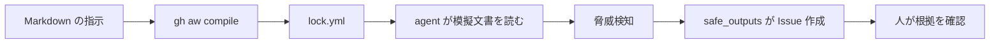

# Advanced: AI に影響候補をまとめてもらう

[受講者 README に戻る](../README.md)

## 何が変わるか（7分）

通常 Actions は「同じハッシュか」を決まった手順で調べます。ここでは GitHub Agentic Workflows が、模擬文書を読んで「どの節に影響しそうか」を日本語の Issue にまとめます。**AI は候補を出すだけで、ファイルを書き換えたり承認したりしません。**

GitHub Agentic Workflows は Public Preview です。記載と生成物は `gh-aw v0.86.2` で検証しています。利用可否・課金・仕様は開催前に [公式チュートリアル](https://docs.github.com/en/actions/tutorials/develop-agentic-workflows-in-github-actions) と組織のポリシーで再確認します。

| 名前 | この演習との関係 |
| --- | --- |
| GitHub Agentic Workflows | Markdown の指示を Actions で実行する、本章の対象 |
| Copilot CLI | このサンプルが選ぶ AI エンジン。参加者が端末で起動する必要はない |
| Copilot coding agent | Issue などから実装を委任する別の体験。本章では使用しない |
| IDE agent mode / skills / custom agents | ワークフロー作成の補助・手順の再利用。実行の必須条件ではない |
| MCP | ツール接続の規約。今回は外部の業務システムを接続しない |

## 構造を読む（10分）



まず [.github/workflows/guideline-impact-report.md](../.github/workflows/guideline-impact-report.md) を開きます。先頭の `---` で囲まれた部分が frontmatter、残りが AI への指示です。

| 設定 | この例での意味 |
| --- | --- |
| `on.workflow_dispatch` | 勝手に定期実行せず、人が開始する |
| `permissions.contents: read` | リポジトリ本文を読む |
| `permissions.copilot-requests: write` | 組織課金で Copilot を呼び出す権限。ファイル編集権限ではない |
| `tools.bash` | 模擬文書2つを読む `cat` コマンドを許可する |
| ルートの `max-ai-credits: 2` | agent の AI 利用を制限する |
| `safe-outputs.threat-detection.max-ai-credits: 2` | 脅威検知側にも別の制限を設ける |
| `create-issue.max: 1` | レポートの作成要求を1回につき最大1件にする |
| `report-failure-as-issue: false` | 失敗通知の別 Issue を作らず、ログで確認する |

`max-ai-credits` は `engine` の内側ではありません。古い教材から貼り付けると compile が失敗します。**agent 側の2 Credits は実行全体の総額上限ではありません。** 脅威検知の AI 利用と Actions 実行費用、再実行を別に考え、組織の予算管理も行います。少ない上限ではレポートが完成する前に停止する可能性があります。参加者判断で引き上げないでください。

次に [.github/workflows/guideline-impact-report.lock.yml](../.github/workflows/guideline-impact-report.lock.yml) を開きます。長い生成物なので全文を読む必要はありません。ページ内検索で `agent:`、`detection:`、`safe_outputs:`、`permissions:` を探します。agent には `contents: write` / `issues: write` がなく、書き込みは別 job です。`conclusion` にもレポート処理用の `issues: write` が生成されるため、safe_outputs だけを見て終わりにしないでください。

読み取り中心とは **GitHub 側のリポジトリ権限** の話です。生成物には既定の読み取りツールやローカル作業用機能も追加され、OS のファイルシステムが読み取り専用になるわけではありません。2文書だけを分析するのは指示上の範囲であり、2ファイル以外を読めない隔離を保証するものではありません。このサンプルではファイル変更を公開する safe output を許可していません。

これらは事故のリスクを下げる仕組みで、分析の正しさを保証するものではありません。文書内の命令に従わない指示も含めていますが、人による出力確認は省略しません。

## 完成版を実行する（10分）

講師が利用可否・ラベル・費用設定を確認済みの場合だけ進みます。基礎 Step 3 の模擬更新が `main` に入っていることを確認してください。

1. `Actions` → `Advanced Guideline Impact Report` を選びます。
2. `Run workflow` を開き、`main` を選びます。内部用の `aw_context` 入力欄が出ても空のままにします。
3. 一度だけ実行し、run を開きます。AI の処理時間は一定ではありません。
4. 終了後、`Issues` で `[guideline-impact]` から始まる Issue を開きます。
5. 「S3 の設定確認」に関する候補、根拠の引用、証跡の形式・保管期間が未決定である点を、人が元文書と突き合わせます。この例どおりの文言が必ず出るとは限りません。
6. `Code` でガイドライン本文が変更されていないこと、run の `safe_outputs` job が Issue を作成したことを確認します。

**期待結果**: 影響候補と根拠を記載した Issue が1件できます。作成上限は「実行ごと」なので、再実行すると別の Issue と費用が発生し得ます。生成文の語句や結論は固定ではありません。

**困ったら**: 認証、AI 利用上限、threat detection、safe outputs のどこで停止したかログを見ます。文書が読めないときは `noop` で終了するよう指示しているため、Issue なしの終了もあり得ます。無制限に再実行せず講師へ連絡します。

10分以内に終わらなければ、進行は講師の事前実行結果へ切り替えます。継続不要な自分の run は `Cancel workflow` で停止します。

## 見学ルート

組織ポリシーや課金設定で実行できない場合は、講師が事前に実行した run と生成 Issue を画面共有します。参加者は「入力の引用が正しいか」「未確認が明記されているか」「人の承認が残るか」を確認します。

実績 URL は [docs/instructor.md](instructor.md) に講師が記入します。実 run が用意できなければ、source と lock の構造確認までとし、Issue 作成を確認済みとは扱いません。

## 講師・持ち帰り用: 編集と再 compile

この節だけ CLI を使います。ローカルへ clone した**独立した演習リポジトリのルート**で実行します。基礎編の受講者は実施不要です。

```bash
gh --version
gh auth status
gh extension install github/gh-aw --pin v0.86.2
gh aw version
git switch -c practice/impact-prompt
```

拡張が導入済みなら install は省略し、版を確認します。認証が必要なら `gh auth login --scopes repo,workflow` を使い、認証情報は端末の案内に従って入力します。資料・チャット・ログには貼り付けません。

1. source の「Issue に含めること」に「対応の優先度とその理由」を追加します。
2. 次のコマンドで compile します。

   ```bash
   gh aw compile guideline-impact-report
   git diff -- .github/workflows/guideline-impact-report.md \
     .github/workflows/guideline-impact-report.lock.yml .github/aw/actions-lock.json
   ```

3. 指示と生成物の両方をレビューします。権限、Action の SHA、入力、出力制限に意図しない変更がないことを確認します。
4. source / lock と変更された補助ファイルをコミットし、変更用ブランチを push して PR を作ります。人がレビュー・マージしてから手動実行します。

```bash
git add .github/workflows/guideline-impact-report.md \
  .github/workflows/guideline-impact-report.lock.yml .github/aw/actions-lock.json
git commit -m "docs: refine guideline impact report"
git push --set-upstream origin practice/impact-prompt
gh pr create --base main --title "影響レポートの指示を改善" --body "source と生成 lock のレビューをお願いします。"
```

`gh aw init` はエージェント向けの作成支援ファイルを追加する操作です。この完成サンプルを実行・compile するためには不要です。自分で新しい workflow を作り始めるときだけ公式手順に沿って検討します。

### 講師が事前に確認する項目

- [ ] GitHub.com の組織所有リポジトリで、Issues と Actions が有効。
- [ ] 組織管理者が Agentic Workflows と Copilot の利用・課金を許可している。
- [ ] この構成では `copilot-requests: write` と組み込み `GITHUB_TOKEN` を使う。個人 repo 向け PAT 設定と混在させない。
- [ ] `guideline` と `impact-analysis` のラベルを事前に作成した。
- [ ] lock が参照する Action / コンテナーと AI 通信が組織の許可対象になっている。
- [ ] source / lock を配置し、実 run で入力読み取り・Issue 作成・本文不変・利用量を確認した。
- [ ] 2つの `max-ai-credits` 設定と、組織側予算の両方を確認した。上限超過を実測したかどうかは、設定の確認とは分けて記録する。

## 判断を言葉にする（3分）

ハッシュ比較や定型の通知は通常 Actions、文脈の解釈や影響候補の整理は Agentic Workflows、反映の承認は人です。課金・出力の揺れ・誤分析への対応を含めて採用を判断します。次段階は実 AWS 情報の取得、AI 分析の有用性評価、SharePoint 連携の順に、別途設計してください。
